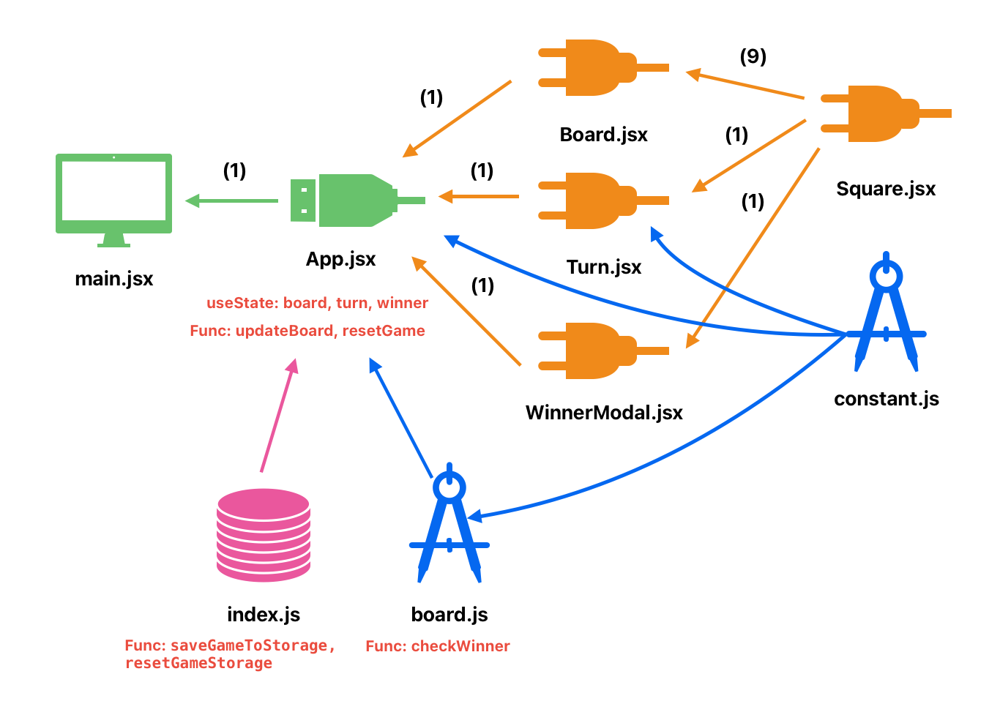
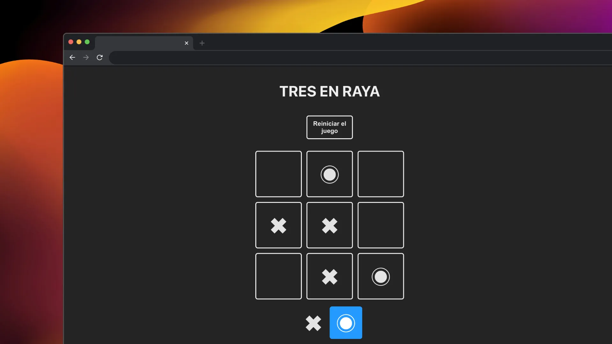

# JUEGO TRES EN RAYA (GUARDADO EN LOCAL STORAGE)

## JS + React + Vite

### ESQUEMA

  

### INTERFAZ

  

Primero hay que pensar en que objetos y datos se necesita para formar el juego:
1_Necesitaremos principalmente un tablero que podría ser una constante de 9 elementos ya que va a ver 9 posiciones posibles.
2_Tambien vamos a necesitar dos jugadores es decir dos turnos por lo tanto necesitaríamos una constante como un objeto con dos valores (como ‘X’ y ‘O’).

Podemos crear un tablero de forma estática dentro de la App, donde cada posición sea un ‘div’ para formar una celda.

Y veríamos luego de crear cada celda como un componente.

Esta celda (componente) debería de estar formada por la posición en la que se encuentre del tablero,  el valor que contenga (null, ’X’, ‘O’) y una función para actualizar el valor de la celda cuando se seleccione (el parámetro más importante).

Entonces como Hook de estado (useState) necesitaremos el tablero con las 9 posiciones que se tiene que ir guardando el resultado y actualizándose.

Igualmente necesitaremos un estado para el turno (‘X’ y ‘O’) que debemos de ir sabiendo y actualizando cuando cambie.

Yo pensaría y dividirá todo en 3 partes: componentes necesarios, estados necesarios, lógica funcional.

## 4 COMPONENTES
 
### Board.jsx 
Parámetros:
1. board: el estado es el que se encuentra en el tablero.
2. updateBoard: una función de actualizar el tablero, comprobando todo lo necesario (se encuentra en cada celda).
Descripción:
Mostrar el tablero con las 9 celdas.

### Square.jsx
Parámetros:
1. children: el valor que debe tener dentro del tablero 'X' o 'O'.
2. index: saber que celda se ha clicado.
3. updateBoard: una función de actualizar el tablero, comprobando todo lo necesario.
Descripción:
Es un recuadro de la celda que pertenecerá al tablero (que tendrá en total 9).

### Turn.jsx:
Parámetros:
1. turn: el estado del turno para saber si es el jugador con valor 'O' o 'X'.
Descripción:
Es un recuadro dependiendo de que turno toque al usuario.

### Winner.jsx:
Parámetros:
1. winner: es el resultado de la partida, si es null no ha acabado la partida, si es false hay empate (tablas), si es 'X' o 'O' hay un ganador.
2. resetGame: es la función para reiniciar el juego.
Descripción:
Saldría en formato de pop up una celda con el valor del ganador o empate y el botón de reset.

## 3 ESTADOS (UseState)
- Board: las nueve posiciones del tablero (cada celda).
El estado inicial seria nueve posiciones a null y se va a ir actualizando por movimiento.

- Turn: las dos posibles posiciones del turno según el jugador, es decir ‘X’ y ‘O’.
El estado inicial seria ‘X’ se irán actualizando en cada movimiento.

- Winner: el valor de la partida, si sigue en juego (null), si ya hay un ganador (‘X’ o ‘O’) o si ha habido empate (false).
El estado inicial seria null (que la partida no ha finalizado) y se iría actualizando por movimiento.

## LÓGICA
- Función para actualizar tablero.
1_Comprobar si se puede modificar el tablero (puede que esa celda ya está marcada o que ya haya un ganador de la partida)
2_Actualizar el tablero.
3_Cambiar el turno al otro jugador.
4_Revisar si hay un ganador (función aparte ‘Comprobar ganador’)

- Función para reiniciar partida.
1_Resetear los estados del tablero (las 9 posiciones a null), el turno (a ‘X’) y el ganador (a null, sigue la partida activa).

- Función para comprobar ganador.
Se le pasa el tablero.
Se crea un array con los índices de los 9 posibles casos de ganar la partida si coincide el valor de esos índices. Se recorre toda la tabla viendo si en algún caso esos índices tienen el mismo valor en el tablero.
En caso de que no sea a si devuelve ‘null’ en cambio sí hay una coincidencia devuelve el valor (‘X’ o ‘O’) en el que coincide esos 3 índices.
